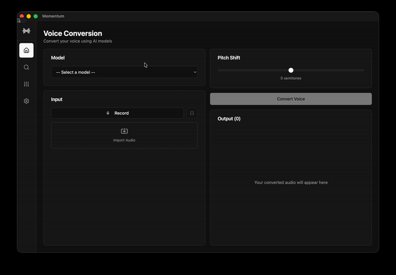

# Momentum

An AI-powered app that transforms audio recordings using advanced RVC voice-conversion models.



## Features

- Advanced RVC voice conversion technology
- ONNX model support
- High-quality audio transformation
- Simple, intuitive interface
- Completely free to use

## Download

Visit [momentumrvc.app](https://momentumrvc.app/) to download Momentum for Windows, macOS, or Linux.
Or look at the releases section.

## Installation

### macOS
After downloading, remove the quarantine attribute:
```bash
xattr -d com.apple.quarantine /path/to/Momentum.app
```

### Windows
You may see a SmartScreen warning. Click "More info" and then "Run anyway" to proceed.

### Linux
Make the application executable:
```bash
chmod +x momentum
```

## Current Status

Momentum currently supports ONNX format models. I'm actively developing additional features and format support.

## Open Source

If there's enough community interest, Momentum will be made open source! Help us reach the goal by showing your support.

**[👍 Vote to Open Source Momentum](https://github.com/OmarKanj/momentum-website/issues/1)**

## License

Free to use.

---

**Website:** [momentumrvc.app](https://momentumrvc.app/)

© 2024 Omarkanj. All rights reserved.
